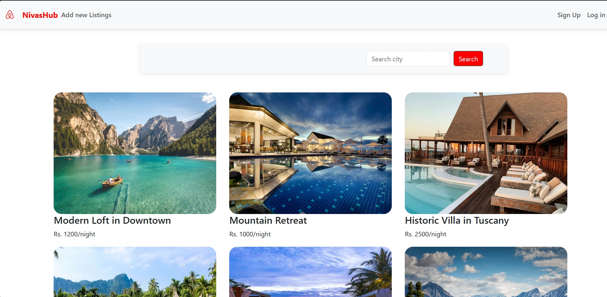
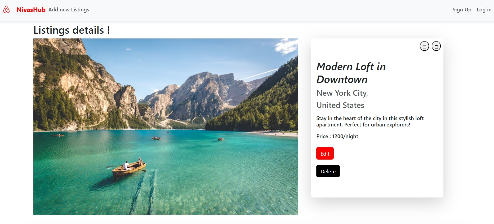
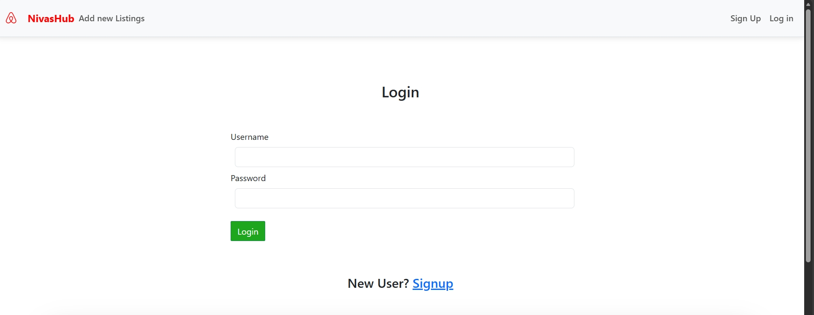

# NivasHub 

A Web project (Node.js,Express.js,EJS,MongoDB) application that allow users to browse listings, view property details , includes user authentication and responsive UI.

## Features 
- User Authentication (Login/Signup)
- CRUD Operations
- Responsive UI
- Secure password handling

## Tech Stack

### Frontend
- HTML5, CSS3, Bootstrap, EJS

### Backend
- Node.js
- Express.js
- MongoDB
- Mongoose

### Tools & Others
- Git & Github
- VS code
- Passport

## Screenshots 📸📸
### Home Page

### Details Page

### Login Page

⭐More screenshots are available in screenshot folder